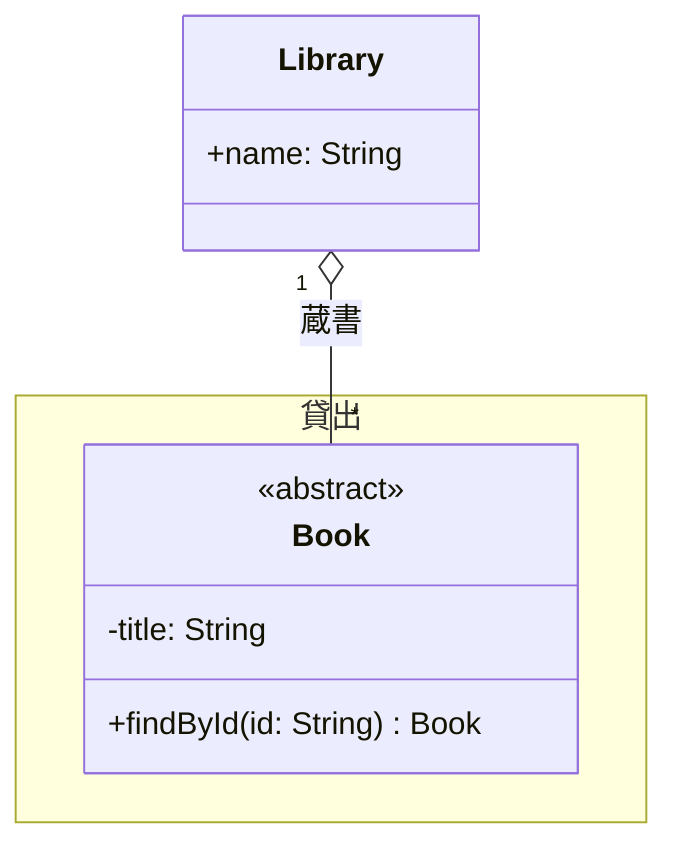

# 設計書（指示書） — Mermaid 記法 Markdown 書き出し

> `/design-handoff` の成果物。3セッション（Sonnet A / Sonnet B / リーダーOpus）が共通の地図として読む。
> 要件定義書 `01-requirements.md`（承認済み 2026-07-17）を入力とする。

最終更新: 2026-07-17
ステータス: **承認待ち**

## 1. アーキテクチャ概要

`Diagram`（永続データ）から Mermaid 文字列を作る **純粋関数のパイプライン**。DOM に一切触らない層と、ダウンロードだけを担う層を分ける。

```
DiagramEditor
  └ flowToDiagram(nodes, edges) → Diagram        ← 既存。そのまま流用
      └ exportDiagramMermaid(diagram)            ← 新規・唯一の公開 API（Leader）
          ├ diagramToMermaid(diagram) → string   ← 純粋関数。ここが本体（Leader が組立）
          │   ├ createNameRegistry(classes)      ← A: 名前サニタイズと ID 採番
          │   ├ groupClassesByPackage(...)       ← B: 座標の包含判定
          │   ├ buildClassBlock(cls, registry)   ← A: class ブロック（属性・操作）
          │   └ buildRelationLine(edge, registry)← B: 関連線（向き入れ替え・多重度）
          └ Blob → <a download> で .md を保存     ← Leader
```

データの流れは一方向で、副作用は最後のダウンロードだけ。`diagramToMermaid` が純粋関数なので、**Mermaid 構文の正しさは単体テストで担保できる**（これが本設計の最大の狙い）。

## 2. 技術選定と理由（Why）

| 領域 | 採用 | 理由 |
|------|------|------|
| 変換ロジック | 依存追加なしの純粋関数 | 文字列を組み立てるだけで、Mermaid 本体（描画エンジン）は不要。バンドルを太らせない |
| ダウンロード | `Blob` + `URL.createObjectURL` | 既存 `jsonIo.ts` と同じ流儀。画像書き出しの dataURL 方式より .md 向き |
| テスト | **Vitest**（devDependency 新規） | 現状テスト基盤が無い。純粋関数の塊なので費用対効果が高く、後続機能にも効く |
| 構文検証 | `mermaid.parse()` を test 内で実行（devDependency 新規） | 「実際に描画できる」を人手でなく CI で担保するため。**実現可否は L1 で検証**（§7 リスク1） |
| 名前解決 | `NameRegistry` オブジェクト | サニタイズ後の ID を A と B の両方が必要とする。ここを唯一の拠り所にして重複実装を防ぐ |

> Why を必ず書く。状況が変わったときに各セッションが自分で判断できるようにするため。

## 3. ディレクトリ / モジュール構成

**新規ファイルを細かく割ってあるのは、A と B のオーナー範囲を1ファイルも重ねないため。** 1つの大きな `exportMermaid.ts` にすると2人が同じファイルを奪い合って並行作業が壊れる。

```
src/lib/mermaid/
  types.ts        … 共有の型・定数。L1 で作り、以後【凍結】（変更は要相談）
  identifiers.ts  … [A] クラス名サニタイズ / NameRegistry
  members.ts      … [A] 属性・操作の1行整形、型のジェネリクス変換
  classBlock.ts   … [A] class ブロック組み立て（ステレオタイプ含む）
  relations.ts    … [B] 関連6種 → 矢印。向き入れ替え・多重度・ラベル
  namespaces.ts   … [B] 座標の包含判定でクラスをパッケージへ振り分け
  document.ts     … [L] 全体組み立て（見出し＋```mermaid フェンス）
src/lib/exportMermaid.ts     … [L] 公開 API とダウンロード
src/components/Toolbar.tsx   … [L] ボタン追加（既存ファイル）
src/components/DiagramEditor.tsx … [L] 配線（既存ファイル）
```

テストは各実装ファイルの隣に `*.test.ts` で置く（オーナーはそのファイルの担当者）。

## 4. インターフェース契約（セッション間の境界）

> **最重要。ここが曖昧だと並行作業が破綻する。** L1 で `types.ts` として実体化し、以後は凍結。
> 変更が要るときは自分で直さず、ボードの「要相談」に起票してリーダーの裁定を待つこと。

### 4-1. 共有する型（`src/lib/mermaid/types.ts`）

```ts
/** ClassNode.id → Mermaid のクラス識別子（サニタイズ済み・図内で一意）を引く。 */
export interface NameRegistry {
  /** 未知の id には null を返す（壊れたエッジを黙って落とすため）。 */
  idOf(classNodeId: string): string | null;
}

/** クラスをパッケージへ振り分けた結果。 */
export interface PackageGrouping {
  /** namespace として出すパッケージと、その所属クラス（Diagram の並び順を保つ）。 */
  grouped: { pkg: PackageNode; classes: ClassNode[] }[];
  /** どのパッケージにも属さないクラス（namespace の外に出す）。 */
  ungrouped: ClassNode[];
}

/** Mermaid のインデント1段（半角スペース4つ）。 */
export const INDENT = "    ";
```

### 4-2. 関数シグネチャ（境界）

```ts
// [A] identifiers.ts
export function createNameRegistry(classes: ClassNode[]): NameRegistry;
/** Mermaid のクラス名規則（英数字・Unicode・_・-）に反する文字を "_" に置換。 */
export function sanitizeMermaidName(name: string): string;

// [A] classBlock.ts
/** class ブロックを行の配列で返す（インデント無しの状態。namespace 内への字下げは呼び出し側=document.ts の責務）。 */
export function buildClassBlock(cls: ClassNode, registry: NameRegistry): string[];

// [B] relations.ts
/** 関連1本を1行に。source/target が registry で解決できなければ null（＝出力しない）。 */
export function buildRelationLine(edge: Edge, registry: NameRegistry): string | null;

// [B] namespaces.ts
export function groupClassesByPackage(
  classes: ClassNode[],
  packages: PackageNode[]
): PackageGrouping;

// [L] document.ts
export function diagramToMermaid(diagram: Diagram): string;
```

### 4-3. 越境ルール（重要）

- **B は A の `sanitizeMermaidName` / `NameRegistry` を import してよい。** オーナーシップは「編集の権利」であって「参照の禁止」ではない。B が同じサニタイズを再実装するのは禁止（二重管理になるため）。
- ただし **A のファイルを B が書き換えるのは禁止**。挙動を変えたければ「要相談」へ。
- `registry.idOf()` が `null` を返したときの扱いは **呼び出し側が黙って読み飛ばす**（例外を投げない）。壊れたデータでも .md の生成自体は成功させる。

### 4-4. 出力フォーマット（確定仕様）

~~~~md
# クラス図


~~~~

- 見出しは `# クラス図` 固定。ファイル名は `class-diagram-YYYYMMDD.md`（`jsonIo.ts` の `todayStamp()` と同形式）。
- 行末に余計な空白を残さない。ファイル末尾は改行1つ。

### 4-4-2. 要件 §8 の未確定事項の決着（L1 で検証済み・2026-07-17）

**検証方法**: mermaid 11.16.0 を jsdom 下で読み込み `mermaid.parse()` に実際にかけた結果と、mermaid 本体のメンバ解析実装（`parseMember`）の読解による。推測ではない。

| 論点 | 結論 | 根拠 |
|------|------|------|
| 属性の型の書き順 | **`-title: String`（アプリの表示と同じ順）を採用** | パースが通る。属性は「先頭が可視性・末尾が分類子・残りが全部そのまま表示テキスト」という実装のため、`名前: 型` がそのまま表示される |
| static / abstract と戻り型の並び | **`+find()$ Book`（括弧の直後に分類子）を採用** | `+find() Book$` も同じ結果になるが、それは「戻り型の末尾1文字が `$*` なら分類子とみなす」フォールバックに依存する。括弧直後なら正規表現が直接拾うので確実 |
| `class X["ラベル"]` | **使える。ただし元の名前がサニタイズで変わったときだけ使う** | 11.16.0 でパース可。ただし比較的新しい構文で、貼り付け先（GitHub 等）の mermaid が古いと壊れ得る。**名前がそのまま通るクラスでは使わない**ことで、互換リスクを「そうしないと情報が失われる場合」だけに限定する |
| 空図（クラス0件） | **要件 F10 の前提が誤り。`classDiagram` 単独は構文エラーになる** | 実測。フォールバックとして `note "クラスがありません"` を1行出す（これはパースが通ることを確認済み） |
| ジェネリクスの `~` 変換 | **変換する（要件 §8-5 のまま）。ただし必須ではない** | `List<String>` も mermaid 側が `&lt;` へエスケープして literal 表示するので壊れない。`~` に変換すると mermaid のジェネリクスとして正しく解釈される分だけ上等。カンマを含む場合に素通しする方針も変更なし |
| クラス名として通る文字 | 実測では `My Class`（空白）や `Book.Item`（ドット）も通ってしまうが、**ドキュメントどおり英数字・Unicode・`_`・`-` に限る保守的なサニタイズを維持** | 通る＝意図どおり解釈される保証ではない。`注文(Order)` `Book#1` `a/b` は実際に構文エラーになることを確認済み |

### 4-5. 関連の対応表（要件 §4-1 の再掲。**向きに注意**）

| kind | Mermaid 出力 | 備考 |
|------|--------------|------|
| `association` | `source --> target` | |
| `aggregation` | `source o-- target` | source が全体 |
| `composition` | `source *-- target` | source が全体 |
| `generalization` | `target <\|-- source` | **左右を入れ替える** |
| `realization` | `target <\|.. source` | **左右を入れ替える** |
| `dependency` | `source ..> target` | |

多重度つきの完全形: `左 "左の多重度" 矢印 "右の多重度" 右 : ラベル`
**左右を入れ替える kind では多重度も一緒に入れ替えること**（入れ替え忘れは B1 の主要バグ源）。空の多重度・ラベルは丸ごと省略する。

## 5. タスク分割方針

**機能分割**（レイヤー分割ではなく）を採る。理由: この機能は UI がボタン1つしかなく、レイヤーで割ると B の仕事が実質ゼロになる。変換ロジックを「**クラスの中身**（A）」と「**クラスの間の関係と、クラスをまとめる枠**（B）」で割ると、分量がほぼ均等で、依存も `NameRegistry` の一点に集約できる。

- **A = クラスの内側**: 名前・属性・操作・ステレオタイプ・可視性・static/abstract・型
- **B = クラスの外側**: 関連線・向き・多重度・ラベル・namespace の振り分け
- **L = 土台と統合**: 契約の実体化・テスト基盤・全体組み立て・UI 配線

依存関係: **L1（契約＋テスト基盤）が A・B のブロッカー。L1 完了後に A と B を同時に走らせる。**
詳細な割り当てとファイルオーナーシップは `03-board.md` に記載。

## 6. 品質基準（リーダーOpusのレビュー観点）

- `npx tsc --noEmit` と `npm run lint` が通る。
- 個人設定の遵守: 関数30行目安・型注釈必須・マジックナンバー定数化・**any 禁止**・デバッグ用 console.log を残さない。
- 受け入れ条件（要件定義 §7）の充足。特に **汎化の向き**は実際に描画して目視確認する。
- 既存の JSON / SVG / PNG 書き出しに回帰がないこと。
- 変換関数が純粋であること（DOM・Date・乱数に依存しない。日付はダウンロード層のみ）。

## 7. リスクと対策

1. **`mermaid.parse()` がヘッドレスで動かないかもしれない**（未検証）。mermaid は描画に DOM を要求する。L1 で jsdom 環境下の動作を検証し、**動かなければ潔く諦めて** 手動検証（Mermaid Live Editor に貼る）＋ゴールデンファイル比較テストに切り替える。ここで粘って時間を溶かさないこと。
2. **要件 §8 の未確定3点**（属性の型の書き順 / `class X["ラベル"]` の対応バージョン / static と戻り型の並び）は **L1 で実物を描画して決着させ、この設計書 §4 に追記してから A に渡す。** A が自分で判断して進めると手戻りになる。
3. **汎化・実現の向き**は仕様を読み違えやすい。B1 のテストに「汎化1本」のケースを必ず入れる。
4. **パッケージの包含判定**はクラスの実寸を測らない簡易判定（左上座標のみ）。枠の端に置いたクラスが意図と違う所属になり得るが、要件 §8-4 で合意済み。深追いしない。
5. **A と B の同時 push で `types.ts` が競合**する恐れ。L1 で凍結した後は誰も触らない運用で回避する。
